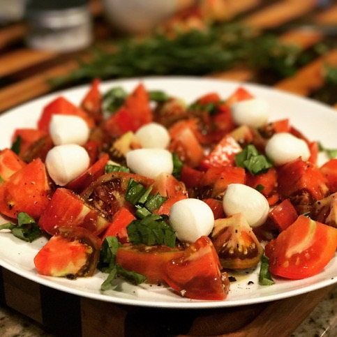

# Caprese Salad

*submitted by jur1st*

Caprese salad is the best part of the summer. Whether you grew the tomatoes yourself or you just paid $5 a pound for the funkiest looking heirloom you could find at the farmer's market while having your ankles smashed by aggressively shopping yoga moms you deserve a good salad on the patio.

The most important thing here is the ingredients. Get tomatoes when they're in season and grow your own basil. We had some incredible basil this year after planting it in the ground instead of in a pot.

---------------------------

Quantity  | Ingredient
----------|-----------------------------
1 pile    | Fresh ripe tomatoes
1 handful | Fresh basil, roughly chopped
2 Tbsp  | Salt, as fancy as you'd like
Some  | Mozarella, the best you can find
4 Tbsp  | Extra virgin olive oil, the best you've got

1. Get started by either chopping or slicing the tomatoes and putting them out on a platter
2. Get the mozarella into bite size chuncks or slices
2. Cut or tear the basil leaves and lay them out on top of the tomatoes
3. Drizzle with olive oil
4. Salt the tomatoes and let everything sit for a couple minutes

Now you may be thinking, "What about the balsamic vinegar?". No need for it if the rest of the ingredents are good enough. The salt helps bring out the sweetness of the tomatoes and once you ditch balsamic you won't go back for it later.
